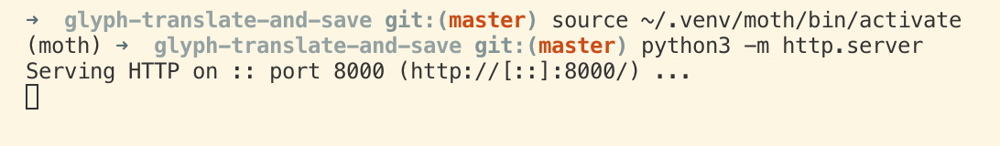

http://localhost        :8000/test.html

# To convert svg to gcode with juicy_code
### Followed https://www.acrylicode.com/svg-to-gcode-walkthrough/

1) Install juicy_code according to repo https://github.com/domoszlai/juicy-gcode
1a) Install vpype with `pip install vpype`
2) Add to PATH variable 
   `sudo nano /etc/paths`
   added "/Users/<user>/.local/bin" to file and saved
3) In directory that has input svg, ran `vpype read input.svg scaleto 19cm 27.7cm linemerge -t 1mm linesort write --page-size a3 --center output.svg`
4) Create default flavor.txt file (according to tutorial)
5) Ran `juicy-gcode output.svg -f flavor.txt -o output.gcode`
   `
